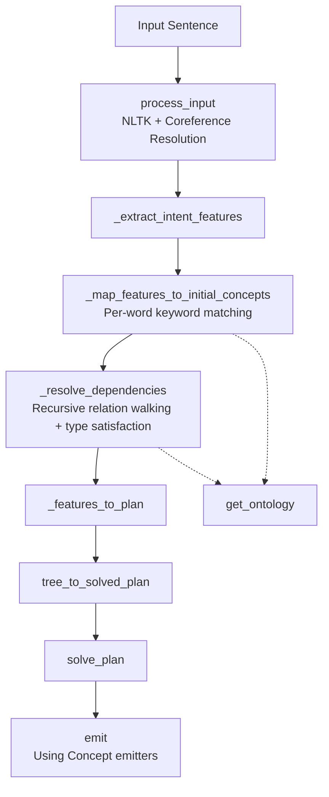

# brain

**Knowledge-driven program synthesis and semantic reasoning.**

`brain` stores knowledge as structured, queryable facts (originally triplets, now also rich plan templates) and uses that knowledge to assemble correct outputs instead of relying on LLM hallucination.

The active implementation is in Python.

---

## Python Path (Current Development Focus)

This is the actively evolving implementation.

### Pipeline

The system follows an ontology-driven flow:



Current demo: "write a Golang program that reads 2 integers and prints their sum" → correct program using `var`/`fmt.Scanf`/`+`/`fmt.Println` emitted from the knowledge base.

### Getting Started (Python)

1. Install dependencies:

   ```bash
   pip install nltk
   ```

2. **Download the required NLTK data** (run once):

   ```python
   import nltk
   nltk.download('punkt')
   nltk.download('punkt_tab')          # newer NLTK versions
   nltk.download('averaged_perceptron_tagger')
   nltk.download('maxent_ne_chunker')
   nltk.download('words')
   ```

   Or from the command line:

   ```bash
   python -c "import nltk; nltk.download(['punkt','punkt_tab','averaged_perceptron_tagger','maxent_ne_chunker','words'])"
   ```

3. Run the demo:

   ```bash
   python main.py
   ```

   Type sentences like:
   - `write a Golang program that reads 2 integers and prints their sum`
   - `write a python program that ...`

4. Run the tests:

   ```bash
   python -m unittest test_augment test_coreference_resolver -v
   ```

### Key Python Files

| File                        | Purpose |
|----------------------------|---------|
| `main.py`                  | Interactive entry point + `process_input()` (NLTK pipeline) |
| `coreference_resolver.py`  | Pronoun resolution on the parsed tree |
| `augment.py`               | `tree_to_solved_plan()`, generic plan builder, `solve_plan()`, `emit()` |
| `kb.py`                    | Python-native Knowledge Base (Node with `needs`, `produces`, `emits`) |
| `test_augment.py`          | Tests for the plan solver and end-to-end NLTK → emission flow |

---

## Knowledge Base

Knowledge lives in two forms:

1. **Rich plan templates** (`kb.py` + the JSONs under `kb/programming_languages/go/...`)
   - Used by the Python solver (`sum`, `print`, `read`, `declaration`, etc.).
   - Each node declares `needs`, `produces`, and `emits` (text + references).

2. **Triplet KB** (the original `kb/*.json` files)
   - Classic `subject verb object` facts with confidence, context, date, etc.

Adding new capabilities is usually just adding a new node to `kb.py` (or a JSON file). The Python feature extractor automatically recognizes any new node IDs that appear in user sentences.

---

## Design Goals

- Move from "ask the LLM to write code" to **"parse intent + assemble from verified knowledge atoms"**.
- Make the system **extensible by data**, not by code changes.
- Support traceability: every emitted line can be traced back to a specific KB entry.

See `DESIGN_DOC.md` for the original four-phase architecture.

---

## Limitations & Future Work

- The current Python KB is still small (focused on the "sum two numbers" example).
- NLTK parsing is a cheap local approximation — a real LLM parser (as described in the design doc) would be more robust for complex sentences.
- No persistent storage or multi-turn conversation context yet in the Python path.

Contributions that expand `kb.py` with new reusable templates (loops, conditionals, different languages, etc.) are very welcome.

---

## License

This project is licensed under the BSD 3-Clause License — see the [LICENSE](LICENSE) file for details.
