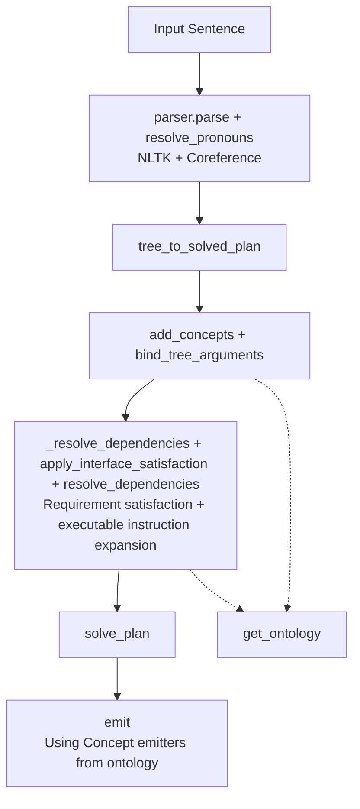
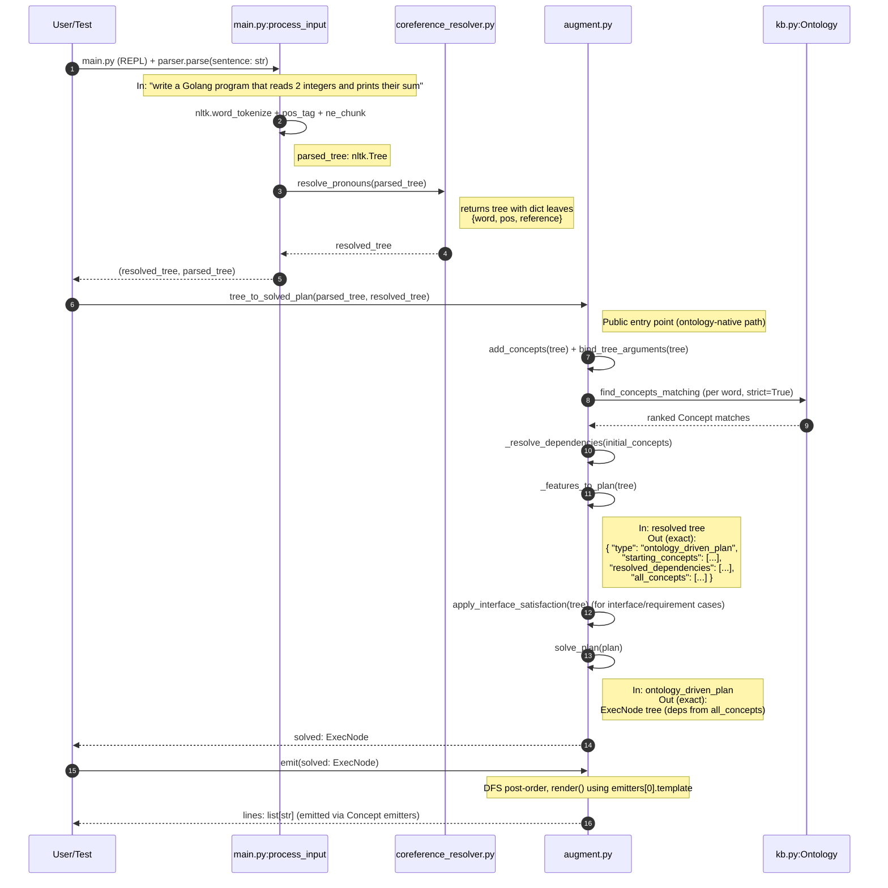

# brain

**Knowledge-driven program synthesis and semantic reasoning.**

`brain` stores knowledge as a structured Ontology of Concepts (JSON-driven, with relations, emitters, and first-class interface support) and uses requirement satisfaction + recursive resolution to assemble correct outputs (code or ordered instruction lists) instead of relying on LLM hallucination.

The active implementation is in Python.

---

## Python Path (Current Development Focus)

This is the actively evolving implementation.

### Pipeline

The system follows an ontology-driven flow:



Current demos:
- Codegen: "write a Golang program that reads 2 integers and prints their sum" → correct program using `var`/`fmt.Scanf`/`+`/`fmt.Println` emitted from the knowledge base.
- General instruction following (via interface requirement satisfaction): "make me a fried egg with salt and pepper" → ordered steps by satisfying a `Recipe` interface (class matching `salt`/`pepper` as `Spice`) and expanding `hasInstructions` action nodes using the same `resolve_dependencies` + emitter machinery.

#### Detailed Data Flow Example

The following trace shows the **exact data flux** for the canonical example used in `test_augment.py`:



**Key observations from this trace:**
- Concept discovery is entirely **KB-driven** (no hardcoded verb lists) via `find_concepts_matching` against the loaded ontology.
- `add_concepts` + `bind_tree_arguments` attach ontology Concepts to the parse tree.
- `_resolve_dependencies` + `apply_interface_satisfaction` + `resolve_dependencies` walk relations, perform requirement satisfaction (including interface + class matching like `Spice`), and expand executable instruction lists from the ontology.
- The final `ExecNode` tree (or direct executable steps) is emitted via per-Concept `emitters` (templates) stored in the ontology JSON files.
- The system now supports general "satisfy requirements → execute the associated ordered instructions" (recipes are one example using `hasIngredients` + `hasInstructions` + action nodes). Emission for the codegen path still includes some placeholders for abstract nodes.

### Getting Started (Python)

1. Install dependencies:

   ```bash
   pip install nltk
   ```

2. **Download the required NLTK data** (run once):

   ```python
   import nltk
   nltk.download('punkt')
   nltk.download('punkt_tab')          # newer NLTK versions
   nltk.download('averaged_perceptron_tagger')
   nltk.download('maxent_ne_chunker')
   nltk.download('words')
   ```

   Or from the command line:

   ```bash
   python -c "import nltk; nltk.download(['punkt','punkt_tab','averaged_perceptron_tagger','maxent_ne_chunker','words'])"
   ```

3. Run the demo:

   ```bash
   python main.py
   ```

   Type sentences like:
   - `write a Golang program that reads 2 integers and prints their sum`
   - `write a python program that ...`
   - `make me a fried egg with salt and pepper` (demonstrates interface satisfaction + instruction resolution)

4. Run the tests:

   ```bash
   # Using the clean explicit runner (recommended)
   python run_tests.py

   # Or classic unittest
   python -m unittest test_augment test_coreference_resolver -v

   # Makefile shortcuts also available (make test, make test-augment, etc.)
   ```

### Key Python Files

| File                        | Purpose |
|----------------------------|---------|
| `main.py`                  | Interactive REPL loop only |
| `parsers.py`               | Parser interface + implementations (default RegexpChunkParser etc.) |
| `coreference_resolver.py`  | Pronoun resolution on the parsed tree |
| `augment.py`               | `tree_to_solved_plan()`, `add_concepts`, `bind_tree_arguments`, `apply_interface_satisfaction`, `resolve_dependencies`, `solve_plan()`, `emit()` |
| `kb.py`                    | `Ontology` + `Concept` loaded from JSONs under `kb/` (go/ constructs+templates under programming_languages/, recipes/ etc.); supports relations, emitters, interfaces (`requires`), `is_a`, class matching, etc. |
| `test_augment.py`          | Tests for the plan solver, interface satisfaction, instruction resolution, and end-to-end flow |

---

## Knowledge Base

Knowledge lives primarily as a structured **Ontology** of `Concept`s (loaded from JSONs under `kb/`):

- Modern examples: `kb/programming_languages/go/...` (constructs, syntax, operators, packages — see e.g. `syntax/print.json` for a representative shape with `relations` for `needs`/`produces`/`partOf`, top-level `context`/`confidence`/`source`/`date`, `emitters`, `keywords`), `kb/recipes/` (the `Recipe` INTERFACE + concrete recipes like `fried_egg` demonstrating `hasIngredients`/`hasInstructions` + class matching), `kb/botany/banana.json` (FACT using `isA` + `parents` for classification).
- Each `Concept` has: `id`, `kind`, `isA` / `parents` (for "is a" / classification — e.g. banana isA fruit), `relations` (e.g. `hasIngredients`, `hasInstructions`, `needs`, `requires`, `produces`, `partOf`, `specializes`), `emitters` (templates for output), `keywords`.
- "is a" relationships (banana isA fruit) are expressed with top-level `isA` (or `is_a`/`isa`) and/or `parents`; the loader and `is_a()` / ancestor walking understand them. Legacy `definitions` arrays inside `relations` are no longer used for new content.
- Interfaces are first-class: a `Recipe` (or any) interface declares required relations via `requires`; concrete concepts provide values. `apply_interface_satisfaction` + `resolve_dependencies` unlock and expand the associated ordered instructions once requirements (including class/subclass matching via `is_a`) are met by context.
- `emitters` (or the structural fallback in `render` for FACTs using isA/parents) are used by `emit`/`render` for final output (code or natural language).

The older triplet `kb/*.json` files and a legacy `Node` style in `kb.py` exist for historical reasons but the active system is the JSON `Ontology`.

Adding new capabilities is usually just adding JSON concept files (or extending relations/emitters/parents/isA). Keyword + relation matching makes new nodes automatically discoverable. Recipes live at `kb/recipes/` (no longer under programming_languages).

---

## Design Goals

- Move from "ask the LLM to write code" to **"parse intent + assemble from verified knowledge atoms"**.
- Make the system **extensible by data**, not by code changes.
- Support traceability: every emitted line can be traced back to a specific KB entry.

See `DESIGN_DOC.md` for the original four-phase architecture.

---

## Limitations & Future Work

- The ontology is still growing (core is Golang constructs + early examples of interfaces + executable instructions such as recipes).
- NLTK parsing is a cheap local approximation — a real LLM parser (as described in the design doc) would be more robust for complex sentences.
- No persistent storage or multi-turn conversation context yet in the Python path.

Contributions that expand the JSONs under `kb/programming_languages/` (new constructs, domains, richer relations like hasInstructions, more action emitters, etc.) are very welcome. The mechanism is generic: declare interfaces + requirements + ordered instruction node ids, and `resolve_dependencies` + emitters do the rest.

---

## License

This project is licensed under the BSD 3-Clause License — see the [LICENSE](LICENSE) file for details.
